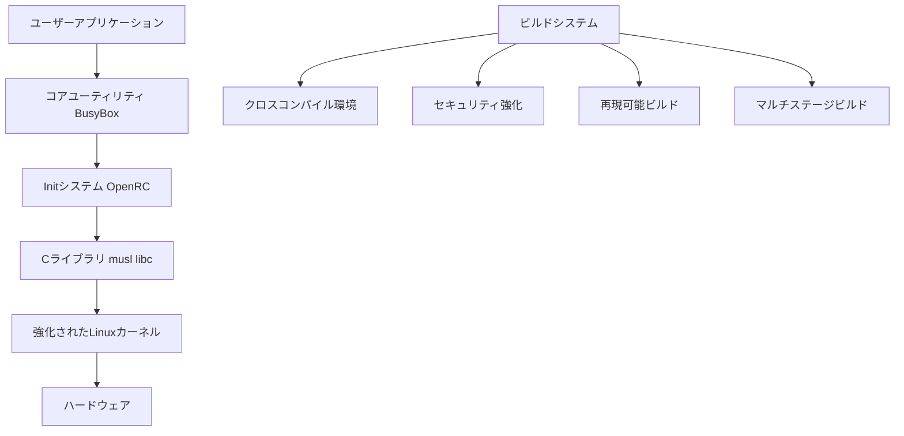

# Kimigayo OS 設計書

## 概要

Kimigayo OSは、Alpine Linuxの設計思想を受け継いだ軽量・高速・セキュアなコンテナ向けオペレーティングシステムです。Dockerイメージとして実行されることを前提に設計され、最小限のリソースで動作し、コンテナ環境やマイクロサービスアーキテクチャで高いパフォーマンスを発揮することを目指します。

### 設計目標
- **軽量性**: ベースイメージ5MB以下
- **高速性**: 10秒以下での起動時間
- **セキュリティ**: セキュアバイデフォルトの設計
- **モジュラー性**: 必要な機能のみを選択可能
- **再現性**: ビット同一のビルド出力

## アーキテクチャ

### システム全体構成



### レイヤー構成

1. **ハードウェア抽象化層**
   - カーネルモジュール（選択可能）
   - デバイスドライバー
   - ハードウェア固有の最適化

2. **システムサービス層**
   - Init システム（OpenRC）
   - システムデーモン
   - ネットワークサービス

3. **ユーザーランド層**
   - BusyBox ユーティリティ
   - musl libc
   - 動的ライブラリ

4. **アプリケーション層**
   - ユーザーアプリケーション
   - パッケージ管理
   - 開発ツール

## コンポーネントとインターフェース

### 1. ビルドシステム

**責任範囲:**
- クロスコンパイル環境の提供
- 再現可能ビルドの実現
- セキュリティ強化の適用
- マルチアーキテクチャサポート

**主要インターフェース:**
```bash
# ビルド設定
./configure --arch=x86_64 --security-hardening=full
make clean && make reproducible-build
make verify-build-hash

# クロスコンパイル
make ARCH=arm64 CROSS_COMPILE=aarch64-linux-musl-
```

**内部構造:**
- Makefileベースのビルドシステム
- 依存関係管理
- ビルド検証機能
- メタデータ生成

### 2. パッケージ管理（Distroless的アプローチ）

**設計方針:**
- パッケージマネージャーを意図的に排除
- マルチステージビルドでビルド時に依存関係を解決
- 不変インフラの実現

**推奨パターン:**
```dockerfile
# ビルドステージ
FROM alpine:3.19 AS builder
RUN apk add --no-cache python3 py3-pip
COPY requirements.txt .
RUN pip install -r requirements.txt

# ランタイムステージ
FROM ishinokazuki/kimigayo-os:latest
COPY --from=builder /usr/lib/python3.11 /usr/lib/python3.11
COPY app.py .
CMD ["python3", "app.py"]
```

**利点:**
- 最小攻撃面
- 予測可能な動作
- イメージサイズの最小化

### 3. Initシステム（OpenRCベース）

**責任範囲:**
- システム初期化
- サービス管理
- 依存関係処理
- ログ管理

**主要インターフェース:**
```bash
# サービス管理
rc-service <service> start|stop|restart|status
rc-update add <service> <runlevel>
rc-status
```

**設定構造:**
```
/etc/init.d/          # サービススクリプト
/etc/runlevels/       # ランレベル設定
/etc/conf.d/          # サービス設定
```

### 4. コアユーティリティ（BusyBox）

**責任範囲:**
- 基本Unixコマンドの提供
- シェル機能
- ネットワークツール
- ファイルシステムユーティリティ

**カスタマイズ可能コンポーネント:**
- シェル（ash/bash）
- ネットワークツール（wget, nc, etc.）
- ファイルツール（tar, gzip, etc.）
- システムツール（ps, top, etc.）

## データモデル

### パッケージメタデータ

```json
{
  "name": "package-name",
  "version": "1.0.0",
  "architecture": "x86_64",
  "dependencies": ["dep1>=1.0", "dep2"],
  "conflicts": ["conflicting-package"],
  "size": 1048576,
  "checksum": {
    "sha256": "abc123...",
    "gpg_signature": "-----BEGIN PGP SIGNATURE-----"
  },
  "build_info": {
    "timestamp": "2024-01-01T00:00:00Z",
    "build_hash": "def456...",
    "compiler": "gcc-13.2.0",
    "flags": ["-O2", "-fPIE", "-D_FORTIFY_SOURCE=2"]
  }
}
```

### システム設定

```yaml
# /etc/kimigayo/system.conf
system:
  architecture: x86_64
  security_level: high
  modules:
    - core
    - network
    - storage
  
build:
  reproducible: true
  hardening: full
  debug_symbols: false

services:
  auto_start:
    - networking
    - logging
  disabled:
    - bluetooth
    - wifi
```

### ビルド設定

```makefile
# ビルド設定
ARCH ?= x86_64
SECURITY_HARDENING ?= full
REPRODUCIBLE_BUILD ?= yes

# セキュリティフラグ
SECURITY_CFLAGS = -fPIE -fstack-protector-strong -D_FORTIFY_SOURCE=2
SECURITY_LDFLAGS = -Wl,-z,relro -Wl,-z,now

# アーキテクチャ固有設定
ifeq ($(ARCH),x86_64)
    CROSS_COMPILE = x86_64-linux-musl-
endif
ifeq ($(ARCH),arm64)
    CROSS_COMPILE = aarch64-linux-musl-
endif
```

## 正確性プロパティ

*プロパティとは、システムのすべての有効な実行において真であるべき特性や動作のことです。本質的に、システムが何をすべきかについての形式的な記述です。プロパティは、人間が読める仕様と機械で検証可能な正確性保証の橋渡しとなります。*

### プロパティ 1: ビルドサイズ制約
*任意の* ビルド設定に対して、生成されるBase_Imageのサイズは5MB未満でなければならない
**検証対象: 要件 1.1**

### プロパティ 2: メモリ使用量制約
*任意の* システム設定に対して、通常動作時のRAM消費量は128MB未満でなければならない
**検証対象: 要件 1.2**

### プロパティ 3: 必須ユーティリティ完全性
*任意の* システム構成に対して、すべての必須UnixユーティリティがCore_Utilitiesを通じて利用可能でなければならない
**検証対象: 要件 1.4**

### プロパティ 4: セキュリティ強化適用
*任意の* システムコンポーネントに対して、コンパイル時にPIE、スタック保護、FORTIFY_SOURCEが有効化されなければならない
**検証対象: 要件 2.1**

### プロパティ 5: ランタイムセキュリティ強制
*任意の* システム起動に対して、ASLRとDEPがランタイムで強制されなければならない
**検証対象: 要件 2.2**

### プロパティ 6: パッケージ検証完全性
*任意の* パッケージインストールに対して、GPG署名とSHA-256ハッシュの検証が実行されなければならない
**検証対象: 要件 2.3**

### プロパティ 7: サービスセキュリティ適用
*任意の* システムサービス開始に対して、名前空間分離とseccomp-BPFフィルタリングが適用されなければならない
**検証対象: 要件 2.4**

### プロパティ 8: セキュリティアップデート優先
*任意の* アップデート状況に対して、セキュリティアップデートが他のアップデートより優先されなければならない
**検証対象: 要件 2.5**

### プロパティ 9: カーネルモジュール選択柔軟性
*任意の* モジュール選択に対して、Build_Systemは個別のカーネルモジュール選択を許可しなければならない
**検証対象: 要件 3.1**

### プロパティ 10: コンポーネント動的管理
*任意の* Core_Utilitiesコンポーネントに対して、システム設定時の追加・削除操作が正常に動作しなければならない
**検証対象: 要件 3.2**

### プロパティ 11: 依存関係最適解決
*任意の* パッケージセットに対して、Package_Managerは不要なパッケージをインストールすることなく依存関係を解決しなければならない
**検証対象: 要件 3.3**

### プロパティ 12: サービス起動制御
*任意の* サービス設定に対して、明示的に有効化されたサービスのみが起動されなければならない
**検証対象: 要件 3.4**

### プロパティ 13: 依存関係解決完全性
*任意の* 依存関係グラフに対して、Package_Managerはすべての必要な依存関係を自動的に処理しなければならない
**検証対象: 要件 4.2**

### プロパティ 14: パッケージ整合性検証
*任意の* パッケージ配布に対して、Package_Managerは暗号化署名を使用して整合性を検証しなければならない
**検証対象: 要件 4.3**

### プロパティ 15: アトミックアップデート操作
*任意の* アップデート操作に対して、Package_Managerは完全に成功するか完全に失敗するかのアトミック性を保証しなければならない
**検証対象: 要件 4.4**

### プロパティ 16: マルチアーキテクチャサポート
*任意の* アーキテクチャ（x86_64、ARM64）に対して、Build_Systemはビルドを成功させなければならない
**検証対象: 要件 5.1**

### プロパティ 17: クロスアーキテクチャ機能一貫性
*任意の* 機能に対して、Build_Systemはサポートされるすべてのアーキテクチャで同一の動作を生成しなければならない
**検証対象: 要件 5.2**

### プロパティ 18: アーキテクチャ固有バイナリ処理
*任意の* アーキテクチャのバイナリに対して、Package_Managerは正しい処理を実行しなければならない
**検証対象: 要件 5.4**

### プロパティ 19: 再現可能ビルド一貫性
*任意の* ソースコードに対して、Build_Systemは複数回のビルドでビット同一の出力を生成しなければならない
**検証対象: 要件 6.1**

### プロパティ 20: 環境独立ビルド
*任意の* ソースコードに対して、Build_Systemは異なるビルド環境で同一のチェックサムを生成しなければならない
**検証対象: 要件 6.2**

### プロパティ 21: ビルド依存関係記録
*任意の* コンポーネントに対して、Build_Systemはすべてのビルド依存関係とバージョンを記録しなければならない
**検証対象: 要件 6.3**

### プロパティ 22: ビルド検証機能
*任意の* ビルド出力に対して、Build_Systemはビルド再現性の暗号化検証を提供しなければならない
**検証対象: 要件 6.4**

### プロパティ 23: ビルドメタデータ包含
*任意の* イメージに対して、Build_Systemは検証用のビルドメタデータを含めなければならない
**検証対象: 要件 6.5**

### プロパティ 24: サービス依存関係順序
*任意の* サービス依存関係グラフに対して、Init_Systemは正しい依存関係の順序でサービスを開始しなければならない
**検証対象: 要件 7.2**

### プロパティ 25: サービス障害処理
*任意の* サービス障害に対して、Init_Systemは失敗をログに記録し、設定されている場合は回復を試行しなければならない
**検証対象: 要件 7.3**

### プロパティ 26: システムシャットダウン処理
*任意の* システム状態に対して、Init_Systemはシャットダウン時にすべてのサービスを正常に停止し、ファイルシステムをアンマウントしなければならない
**検証対象: 要件 7.4**

### プロパティ 27: サービス管理コマンド
*任意の* サービスに対して、Init_Systemは開始、停止、再起動、ステータス操作のためのコマンドを提供しなければならない
**検証対象: 要件 7.5**

### プロパティ 28: musl libc使用
*任意の* ソフトウェアコンパイルに対して、Build_Systemは標準Cライブラリとしてmusl libcを使用しなければならない
**検証対象: 要件 8.2**

### プロパティ 29: リンクオプションサポート
*任意の* バイナリに対して、Build_Systemは静的リンクと動的リンクの両方のオプションをサポートしなければならない
**検証対象: 要件 8.3**

### プロパティ 30: パッケージ互換性ラウンドトリップ
*任意の* ソフトウェアに対して、Build_Systemで生成されたパッケージはPackage_Managerで正常に処理可能でなければならない
**検証対象: 要件 8.4**

### プロパティ 31: カーネルセキュリティ設定
*任意の* カーネルビルドに対して、Build_Systemはすべての必要なSecurity_Hardening設定を適用しなければならない
**検証対象: 要件 8.5**

## エラーハンドリング

### 1. ビルドエラー処理

**エラーカテゴリ:**
- コンパイルエラー
- 依存関係不足
- アーキテクチャ非対応
- セキュリティ検証失敗

**処理戦略:**
```bash
# エラー検出と報告
if ! compile_component "$component"; then
    log_error "コンパイル失敗: $component"
    cleanup_partial_build
    exit 1
fi

# 依存関係チェック
check_dependencies() {
    for dep in $REQUIRED_DEPS; do
        if ! command -v "$dep" >/dev/null 2>&1; then
            error_exit "必要な依存関係が見つかりません: $dep"
        fi
    done
}
```

### 2. パッケージ管理エラー処理

**エラーカテゴリ:**
- ネットワークエラー
- 署名検証失敗
- 依存関係競合
- ディスク容量不足

**処理戦略:**
```bash
# アトミック操作の実装
atomic_install() {
    local package="$1"
    local temp_dir=$(mktemp -d)
    
    # トランザクション開始
    if ! download_and_verify "$package" "$temp_dir"; then
        cleanup "$temp_dir"
        return 1
    fi
    
    # インストール実行
    if ! install_package "$temp_dir/$package"; then
        rollback_changes
        cleanup "$temp_dir"
        return 1
    fi
    
    # コミット
    commit_changes
    cleanup "$temp_dir"
    return 0
}
```

### 3. システム初期化エラー処理

**エラーカテゴリ:**
- ハードウェア初期化失敗
- サービス起動失敗
- 設定ファイルエラー
- リソース不足

**処理戦略:**
```bash
# サービス起動の堅牢性
start_service() {
    local service="$1"
    local max_retries=3
    local retry_count=0
    
    while [ $retry_count -lt $max_retries ]; do
        if service_start "$service"; then
            log_info "サービス開始成功: $service"
            return 0
        fi
        
        retry_count=$((retry_count + 1))
        log_warn "サービス開始失敗 (試行 $retry_count/$max_retries): $service"
        sleep 2
    done
    
    log_error "サービス開始に失敗しました: $service"
    return 1
}
```

## テスト戦略

### デュアルテストアプローチ

Kimigayo OSでは、単体テストとプロパティベーステストの両方を使用した包括的なテスト戦略を採用します。

**単体テストとプロパティテストは相補的です:**
- 単体テストは具体的な例、エッジケース、エラー条件を検証
- プロパティテストはすべての入力にわたって保持すべき普遍的なプロパティを検証
- 両者を組み合わせることで包括的なカバレッジを実現：単体テストは具体的なバグを捕捉し、プロパティテストは一般的な正確性を検証

### 単体テスト

**単体テストの対象:**
- 具体的な例による正しい動作の実証
- コンポーネント間の統合ポイント
- 単体テストは有用ですが、過度に多く書くことは避けます
- プロパティベーステストが多くの入力をカバーする役割を担います

### プロパティベーステスト

**プロパティベーステストライブラリ:** Hypothesis（Python）、QuickCheck（Haskell）、またはfast-check（JavaScript）を使用

**設定要件:**
- 各プロパティベーステストは最低100回の反復実行を行う（ランダムなプロセスのため）
- 各プロパティベーステストには設計書の正確性プロパティを参照するコメントを付与
- タグ形式: '**Feature: kimigayo-os-core, Property {number}: {property_text}**'
- 各正確性プロパティは単一のプロパティベーステストで実装

**テスト例:**

```python
# **Feature: kimigayo-os-core, Property 1: ビルドサイズ制約**
@given(build_config=build_configurations())
def test_build_size_constraint(build_config):
    """任意のビルド設定に対して、生成されるBase_Imageのサイズは5MB未満"""
    image = build_base_image(build_config)
    assert image.size_bytes < 5 * 1024 * 1024

# **Feature: kimigayo-os-core, Property 19: 再現可能ビルド一貫性**
@given(source_code=valid_source_code())
def test_reproducible_build_consistency(source_code):
    """任意のソースコードに対して、複数回のビルドでビット同一の出力を生成"""
    build1 = build_system.compile(source_code)
    build2 = build_system.compile(source_code)
    assert build1.checksum == build2.checksum
```

### テスト環境

**テスト実行環境:**
- 仮想化環境（QEMU/KVM）
- コンテナ環境（Docker）
- クロスアーキテクチャエミュレーション

**継続的インテグレーション:**
- 全アーキテクチャでのビルドテスト
- セキュリティ検証の自動実行
- パフォーマンス回帰テスト