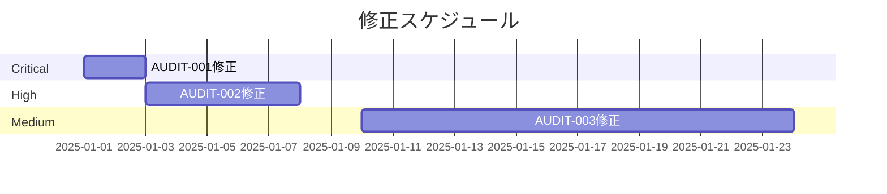

# セキュリティ監査レポート

**監査ID**: AUDIT-YYYY-MM-DD
**監査対象**: Kimigayo OS v[バージョン]
**監査期間**: YYYY年MM月DD日 - YYYY年MM月DD日
**監査実施者**: [監査者名/組織名]
**レポート作成日**: YYYY年MM月DD日

---

## エグゼクティブサマリー

### 監査概要

本セキュリティ監査は、Kimigayo OS v[バージョン]に対して実施されました。監査スコープには[スコープ内容]が含まれ、[監査手法]により実施されました。

### 主要な発見事項

- **Critical**: X 件
- **High**: X 件
- **Medium**: X 件
- **Low**: X 件
- **Info**: X 件

### 総合評価

**リスクレベル**: [Low / Medium / High / Critical]

[総合評価の詳細記述。セキュリティ姿勢、発見された問題の性質、推奨される優先対応事項など]

### 推奨事項サマリー

1. [最優先の推奨事項1]
2. [最優先の推奨事項2]
3. [最優先の推奨事項3]

---

## 監査スコープと手法

### 監査スコープ

#### インスコープ

- [ ] Linuxカーネル設定とセキュリティ機能
- [ ] musl libcライブラリとコンパイル設定
- [ ] BusyBoxコマンドと権限設定
- [ ] OpenRC initシステムとサービス管理
- [ ] isnパッケージマネージャと署名検証
- [ ] ビルドシステムと再現可能ビルド
- [ ] Dockerイメージとコンテナセキュリティ
- [ ] ネットワークセキュリティ設定
- [ ] ファイルシステム権限とアクセス制御
- [ ] ドキュメントとセキュリティポリシー

#### アウトオブスコープ

- [スコープ外項目1]
- [スコープ外項目2]

### 監査手法

- **自動スキャン**: Trivy (脆弱性、設定、シークレット)、ShellCheck (静的解析)
- **手動監査**: [コードレビュー、設定レビュー、ドキュメントレビュー]
- **ペネトレーションテスト**: [実施した場合のみ記載]
- **準拠性チェック**: [CIS Benchmark、NIST等]

### 使用ツール

| ツール | バージョン | 用途 |
|--------|----------|------|
| Trivy | vX.X.X | 脆弱性スキャン |
| ShellCheck | vX.X.X | シェルスクリプト静的解析 |
| [その他] | vX.X.X | [用途] |

---

## 詳細発見事項

### AUDIT-YYYY-MM-001: [発見事項タイトル]

**重大度**: Critical / High / Medium / Low / Info
**CVSS v3.1**: [スコア] ([ベクトル文字列])
**ステータス**: Open / In Progress / Resolved
**発見日**: YYYY-MM-DD

#### 概要

[問題の簡潔な説明]

#### 影響範囲

- **影響を受けるコンポーネント**: [コンポーネント名]
- **影響を受けるバージョン**: [バージョン]
- **影響**: [悪用された場合の具体的な影響]

#### 技術的詳細

[問題の技術的な詳細説明。コード例、設定例、ログなど]

```bash
# 再現手順（該当する場合）
[コマンドやステップ]
```

#### リスク評価

- **可能性**: High / Medium / Low
- **影響度**: High / Medium / Low
- **総合リスク**: Critical / High / Medium / Low

#### 推奨対策

**即座の対応**:
1. [緊急対応策]
2. [暫定回避策]

**恒久対策**:
1. [根本的な修正方法]
2. [再発防止策]

#### 参考情報

- CVE: [CVE-YYYY-NNNNN]
- CWE: [CWE-NNN]
- 関連ドキュメント: [URL]

---

### AUDIT-YYYY-MM-002: [次の発見事項]

[上記と同じフォーマットで記載]

---

## ポジティブな発見

監査中に確認された効果的なセキュリティ対策：

1. **[対策名1]**: [詳細と評価]
2. **[対策名2]**: [詳細と評価]
3. **[対策名3]**: [詳細と評価]

---

## 修正計画

### 優先度別修正リスト

#### Critical（即時対応必要）

| ID | タイトル | 担当者 | 期限 | ステータス |
|----|---------|--------|------|-----------|
| AUDIT-YYYY-MM-001 | [タイトル] | [担当者] | YYYY-MM-DD | Open |

#### High（1週間以内）

| ID | タイトル | 担当者 | 期限 | ステータス |
|----|---------|--------|------|-----------|
| AUDIT-YYYY-MM-002 | [タイトル] | [担当者] | YYYY-MM-DD | Open |

#### Medium（1ヶ月以内）

| ID | タイトル | 担当者 | 期限 | ステータス |
|----|---------|--------|------|-----------|
| AUDIT-YYYY-MM-003 | [タイトル] | [担当者] | YYYY-MM-DD | Open |

#### Low（次回リリースまで）

| ID | タイトル | 担当者 | 期限 | ステータス |
|----|---------|--------|------|-----------|
| AUDIT-YYYY-MM-004 | [タイトル] | [担当者] | YYYY-MM-DD | Open |

### 修正スケジュール



---

## 準拠性評価

### CIS Docker Benchmark

| セクション | 準拠状況 | コメント |
|-----------|---------|---------|
| 1. ホスト設定 | ✅ 準拠 | - |
| 2. Dockerデーモン設定 | ⚠️ 部分準拠 | [コメント] |
| 3. Dockerデーモンファイル | ✅ 準拠 | - |
| 4. コンテナイメージ | ✅ 準拠 | - |
| 5. コンテナランタイム | ⚠️ 部分準拠 | [コメント] |

### NIST SP 800-190 (コンテナセキュリティ)

| カテゴリ | 準拠状況 | コメント |
|---------|---------|---------|
| イメージセキュリティ | ✅ 準拠 | - |
| レジストリセキュリティ | ✅ 準拠 | - |
| オーケストレーション | N/A | - |
| コンテナランタイム | ✅ 準拠 | - |
| ホストOSセキュリティ | ✅ 準拠 | - |

---

## 統計情報

### 発見事項の分布

```
重大度別:
Critical:  ██ 2件 (10%)
High:      ████ 4件 (20%)
Medium:    ████████ 8件 (40%)
Low:       ████ 4件 (20%)
Info:      ██ 2件 (10%)

カテゴリ別:
脆弱性:     ████████ 8件 (40%)
設定不備:   ██████ 6件 (30%)
権限問題:   ████ 4件 (20%)
その他:     ██ 2件 (10%)
```

### CVSSスコア分布

- **9.0-10.0 (Critical)**: X 件
- **7.0-8.9 (High)**: X 件
- **4.0-6.9 (Medium)**: X 件
- **0.1-3.9 (Low)**: X 件

---

## フォローアップ計画

### 再テスト計画

- **Critical/High**: 修正後7日以内に再テスト
- **Medium**: 修正後30日以内に再テスト
- **Low**: 次回定期監査時に確認

### 次回監査予定

- **定期監査**: [YYYY年MM月]（四半期ごと）
- **ペネトレーションテスト**: [YYYY年MM月]（年次）
- **外部監査**: [YYYY年MM月]（メジャーリリース前）

---

## 結論

[監査の総括。全体的なセキュリティ姿勢の評価、改善の進捗、今後の方向性など]

---

## 添付資料

- [ ] 付録A: 自動スキャン結果（Trivy SARIF）
- [ ] 付録B: ShellCheck結果
- [ ] 付録C: 設定ファイル監査結果
- [ ] 付録D: コードレビューチェックリスト
- [ ] 付録E: ペネトレーションテストレポート（該当する場合）

---

## 承認

| 役割 | 氏名 | 署名 | 日付 |
|-----|------|------|------|
| 監査実施者 | [氏名] | | YYYY-MM-DD |
| レビュアー | [氏名] | | YYYY-MM-DD |
| 承認者 | [氏名] | | YYYY-MM-DD |

---

## 改訂履歴

| バージョン | 日付 | 変更内容 | 作成者 |
|----------|------|---------|--------|
| 1.0 | YYYY-MM-DD | 初版作成 | [氏名] |
| 1.1 | YYYY-MM-DD | [変更内容] | [氏名] |

---

**機密性**: [Public / Internal / Confidential / Restricted]

このレポートに含まれる情報は機密であり、承認された関係者のみが閲覧できます。無断での複製、配布、開示を禁じます。
